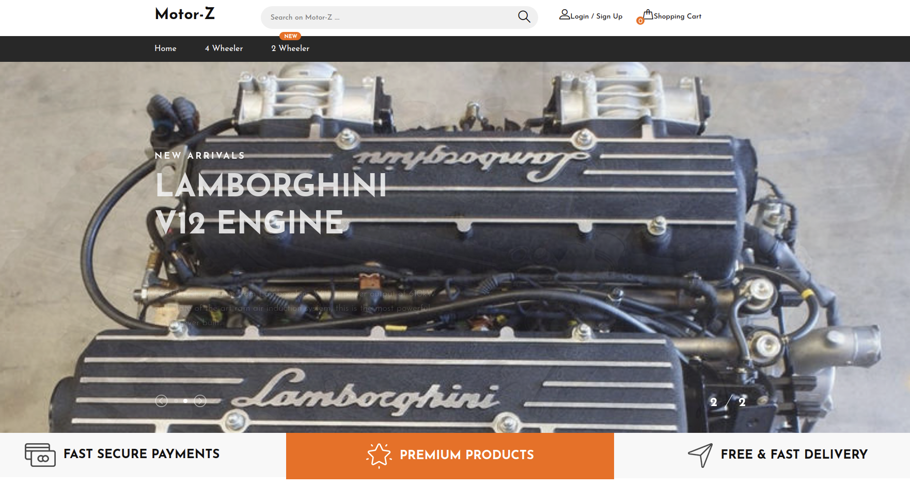
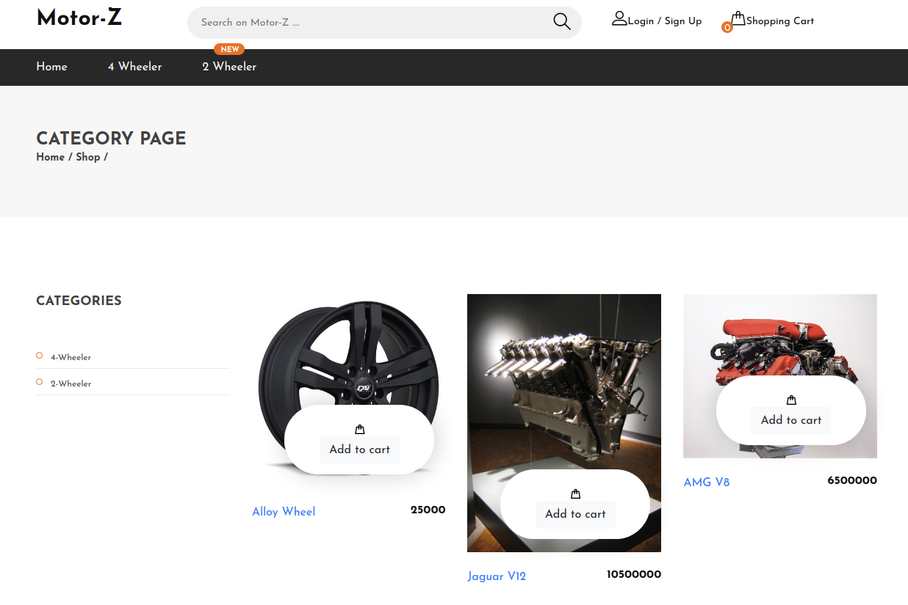
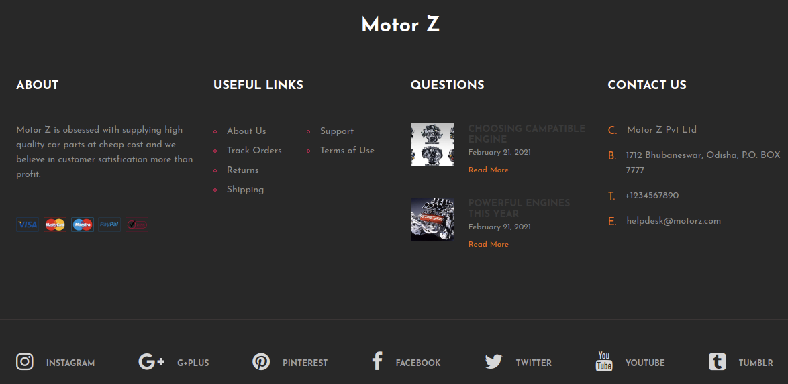
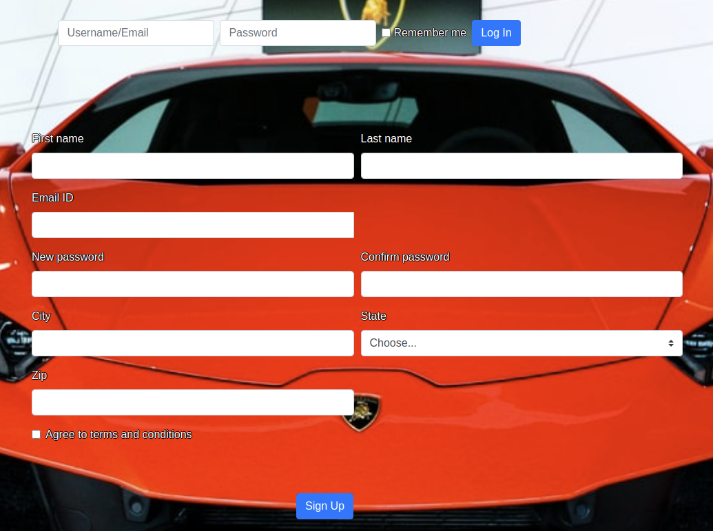

# Motor part shop software

This is a basic implementation of a software to automate the tasks of a motor part shop. This is made as a software engineering lab project.

## Team Members
Biswaranjan Behera - 118CS0151
Rishabh Roshan Malik - 118CS0175
Swaraj Pradhan - 118CS0195
Deepak Kumar Sial - 118CS0214
Koushik Sahu - 118CS0597

## Usage

To build from source: [User Manual](assets/User\ Manual.pdf)

Webapp deployed at: [Motor-Z](https://motor-parts-shop.herokuapp.com/)

## Screenshots

